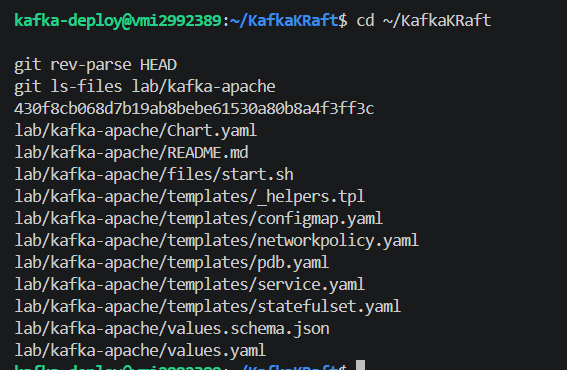
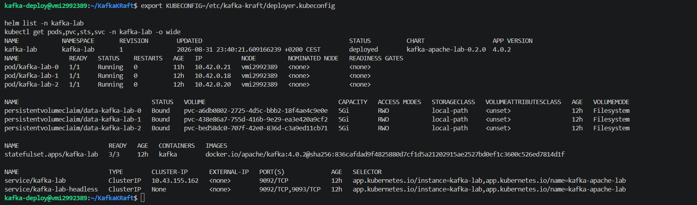
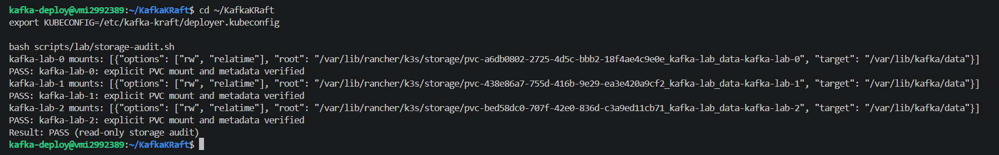
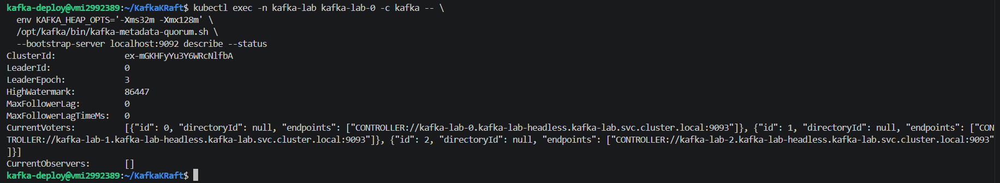
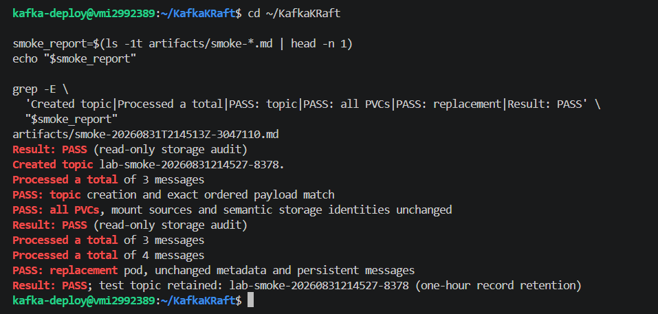

# Gerçek ekran görüntüsü teslimi — tamamlandı

Teslim tarihi: 2026-09-01. Kullanıcının gerçek Contabo terminalinden sağlanan beş PNG dosyası bu klasöre özgün çözünürlükte kopyalandı. Sentetik görsel üretilmedi veya görüntü içeriği düzenlenmedi.

Görsel incelemede parola, token, private key veya kubeconfig içeriği görülmedi. Host adı, cluster içi IP'ler, PVC/PV kimlikleri ve Kafka cluster ID görünür; bunlar authentication credential değildir ancak altyapı metadata'sıdır. Public repository için kullanıcı tarafından sağlanan kanıt olarak korunmuştur.

## Teslim edilen kanıtlar

| Dosya | Boyut | Görsel kanıt | Durum |
| --- | ---: | --- | --- |
| [01-chart-tree.png](01-chart-tree.png) | 567×370 | Checkout SHA `430f8cb...` ve bağımsız `lab/kafka-apache` chart dosyaları | Teslim edildi |
| [02-pods-pvc-services.png](02-pods-pvc-services.png) | 1747×516 | Helm `kafka-apache-lab-0.2.0`, revision 1; üç Running pod, üç Bound PVC, StatefulSet 3/3, iki Service ve sabit ASF image digest'i | Teslim edildi |
| [03-storage-audit.png](03-storage-audit.png) | 1797×279 | Üç pod için exact `/var/lib/kafka/data` PVC mount/metadata PASS; read-only audit PASS | Teslim edildi |
| [04-quorum.png](04-quorum.png) | 1832×336 | KRaft leader, voters 0/1/2, observer yok, max follower lag 0 | Teslim edildi |
| [05-producer-consumer-restart.png](05-producer-consumer-restart.png) | 957×457 | Topic, üç mesaj, aynı PVC/kimlikler, restart sonrası dört mesaj ve replacement pod persistence PASS | Teslim edildi |

## Sınırlar

- Görseller, ilgili komutların görünen terminal çıktısıdır; altta kalan tüm komut geçmişinin veya cluster'ın güvenlik durumunun kanıtı değildir.
- Quorum ekranı leader 0 / epoch 3 / lag 0 ile daha sonraki sağlıklı anı gösterir; önceki smoke çıktısındaki leader 1 ile çelişmez, leader değişebilir.
- Producer/consumer görseli smoke raporunun seçili PASS satırlarını gösterir. Tam ham metin sonuçları [producer/consumer](../tests/producer-consumer-test.md), [topic](../tests/topic-management-test.md) ve [işlem raporunda](../../IMPLEMENTATION-REPORT.md) kayıtlıdır.
- Bu kanıt tek-host laboratuvarı içindir; production HA, TLS/SASL, CVE taraması veya backup/restore onayı değildir.
- Tekrar ekran görüntüsü almak için pod restart/veri silme gerekmez. Güncel salt-okunur kontrol yeterlidir.
